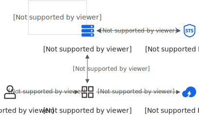
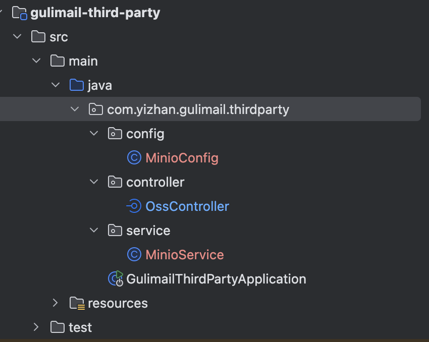

# minIO使用笔记

## 1.minIO安装

**部署环境**

腾讯云轻量应用服务器

**步骤 1：拉取 MinIO 镜像**

```shell
docker pull minio/minio:latest
```

此命令会从 Docker Hub 获取最新版本的 MinIO 镜像。

**步骤 2：创建数据持久化目录**

```shell
mkdir -p /data/minio/data
mkdir -p /data/minio/config
```

这样可以确保容器重启后数据不会丢失

**步骤 3：启动 MinIO 容器**

```shell
docker run -d --name minio \
 -p 9000:9000 \
 -p 9001:9001 \
 -e MINIO_ROOT_USER=admin \
 -e MINIO_ROOT_PASSWORD=Admin123456 \
 -v /data/minio/data:/data \
 -v /data/minio/config:/root/.minio \
 minio/minio server /data \
 --console-address ":9001"
```

- **9000端口**：API 服务
- **9001端口**：Web 控制台
- 用户名和密码可自行修改，建议生产环境使用强密码。

**步骤 4：访问与使用**

- 浏览器访问 *http://<宿主机IP>:9001*
- 输入设置的用户名和密码登录
- 在控制台中创建 **Bucket** 并上传文件。

## 2.MinIO中的基本概念

### 2.1 Bucket（桶）

MinIO 中的 Bucket 可以理解为 Windows 中的盘符（ 如 C 盘、D 盘）

### 2.2 Path / Prefix（路径）

MinIO 中的 Path / Prefix 可以理解为 Windows 中的文件夹

### 2.3 文件

MinIO 中的文件跟 Windows 系统中的文件概念相似

## 3.MinIO Client(MC) 客户端

```shell
//下载MC
wget https://dl.minio.org.cn/client/mc/release/linux-amd64/mc
//添加mc指令
chmod +x /usr/local/bin/mc
//生成accesskey
mc admin user svcacct add myminio admin --name "My Application"
| 部分                        | 含义                            |
| ------------------------- | ----------------------------- |
| `mc`                      | MinIO 命令行客户端                  |
| `admin`                   | 管理员子命令                        |
| `user`                    | 用户管理                          |
| `svcacct`                 | 服务账号管理（旧版术语，新版改为 `accesskey`） |
| `add`                     | 添加/创建                         |
| `myminio`                 | 之前配置的别名，指向你的 MinIO 服务器        |
| `admin`                   | 目标用户（为 admin 用户创建服务账号）        |
| `--name "My Application"` | 给这个服务账号起个名称/描述                |
Access Key: xxxxxx
Secret Key: xxxxxx
Expiration: no-expiry
//设置为公共读
mc anonymous set download myminio/gulimail
//查看权限
mc anonymous get-json myminio/gulimail
```


## 4.MinIO的预签名直传机制



上图为阿里云oss对象存储服务签名直传，与项目中实现的MinIO相似。

### 4.1简介

我们传统使用MinIo做OSS对象存储的应用方式往往都是在后端配置与MinIO的连接和文件上传下载的相关接口，然后我们在前端调用这些接口完成文件的上传下载机制，但是，当并发量过大，频繁访问会对后端的并发往往会对服务器造成极大的压力，大文件传输场景下，服务器被迫承担数据中转的角色，既消耗大量带宽资源，又形成单点性能瓶颈。这时，我们引入了MinIO的一种预签名机制。

预签名机制：在后端对文件的上传和下载操作生成一个URL，前端针对不同的文件操作形式请求会获取到对应的URL，这个URL可以理解为一个临时的通行证，有了这个URL后，前端可以直接向MinIO的服务端发上传和下载的相应请求，与MinIO直连操作，大大减缓了对后端服务器的压力

## 5.Java后端实现



项目中引入minIO可以参考gulimall项目，创建一个第三方微服务。minIO预签名的项目结构如上图

### 5.1 依赖引入

```shell
<dependency>
    <groupId>io.minio</groupId>
    <artifactId>minio</artifactId>
    <version>8.5.10</version>
</dependency>
```

### 5.2 MinIO配置

```java
@Configuration
public class MinioConfig {

  @Value("${minio.endpoint}")
  private String endpoint;

  @Value("${minio.access-key}")
  private String accessKey;

  @Value("${minio.secret-key}")
  private String secretKey;

  @Bean
  public MinioClient minioClient() {
    return MinioClient.builder()
        .endpoint(endpoint)
        .credentials(accessKey, secretKey)
        .build();
  }
}
```

### 5.3 controller

```java
@RestController
@RequestMapping("/oss")
public class OssController {

  @Autowired
  private MinioService minioService;

  /**
   * 获取预签名直传 URL
   * @param fileName 原始文件名
   * @return {uploadUrl, objectKey, accessUrl}
   */
  @GetMapping("/policy")
  public R policy(@RequestParam("fileName") String fileName) {
    Map<String, String> result = minioService.generatePresignedUploadUrl(fileName, 10);
    return R.ok().put("data", result);
  }
}
```

### 5.4 service

```java
@Service
public class MinioService {

  @Autowired
  private MinioClient minioClient;

  @Value("${minio.bucket:gulimail}")
  private String bucket;

  @Value("${minio.endpoint}")
  private String endpoint;

  /**
   * 生成预签名直传 URL
   * @param originalFileName 原始文件名
   * @param expiryMinutes    签名过期时间（分钟）
   * @return {uploadUrl, objectKey, accessUrl}
   */
  public Map<String, String> generatePresignedUploadUrl(String originalFileName, Integer expiryMinutes) {
    String extension = getExtension(originalFileName);
    String datePath = new SimpleDateFormat("yyyy-MM-dd").format(new Date());
    String objectKey = datePath + "/" + UUID.randomUUID().toString().replace("-", "") + extension;

    int expiry = (expiryMinutes != null && expiryMinutes > 0) ? expiryMinutes : 10;

    try {
      String uploadUrl = minioClient.getPresignedObjectUrl(
          GetPresignedObjectUrlArgs.builder()
              .method(Method.PUT)
              .bucket(bucket)
              .object(objectKey)
              .expiry(expiry, TimeUnit.MINUTES)
              .build()
      );

      String endpointClean = endpoint.replaceAll("/$", "");
      String accessUrl = endpointClean + "/" + bucket + "/" + objectKey;

      Map<String, String> result = new HashMap<>();
      result.put("uploadUrl", uploadUrl);
      result.put("objectKey", objectKey);
      result.put("accessUrl", accessUrl);

      return result;
    } catch (Exception e) {
      throw new RuntimeException("生成预签名上传URL失败", e);
    }
  }

  private String getExtension(String fileName) {
    if (fileName == null || !fileName.contains(".")) {
      return "";
    }
    return fileName.substring(fileName.lastIndexOf("."));
  }
}
```

### 5.4 核心概念

| 概念      | 说明                                                         |
| --------- | ------------------------------------------------------------ |
| 预签名URL | 用密钥签名生成的临时加密 URL，持有者可在有效期内执行指定操作（PUT上传/GET下载） |
| 直传      | 文件不经过后端服务器，客户端直接上传到 MinIO，节省带宽和服务器资源 |
| objectKey | MinIO 中文件的唯一路径，类似文件系统的路径名                 |
| accessUrl | 上传完成后文件的公开访问地址                                 |

前端请求 /oss/policy?fileName=cat.jpg
        ↓
后端生成预签名 PUT URL，返回 {uploadUrl, objectKey, accessUrl}
        ↓
前端用 uploadUrl 直接 PUT 文件到minIO

## 6.vue前端

policy.js是与后端交互的代码 singleUpload.vue和multiUpload.vue是放在components中的子组件。

action：设为空占位 "#"（用 http-request 时会绕过它）
- http-request="httpRequest"：完全接管上传逻辑
- beforeUpload：调用 policy(file.name) 拿到 {uploadUrl, accessUrl} 并保存到 this
- httpRequest ：用 XMLHttpRequest 发起 PUT 请求到 uploadUrl
- handleUploadSuccess：直接使用 accessUrl 作为最终URL

### 6.1 policy.js

```javascript
import http from '@/utils/httpRequest.js'
export function policy(fileName) {
   return new Promise((resolve, reject) => {
        http({
            url: http.adornUrl("/oss/policy"),
            method: "get",
            params: { fileName: fileName || 'file' }
        }).then(({ data }) => {
            resolve(data);
        }).catch(err => {
            reject(err);
        })
    });
}
```

### 6.2 singleUpload.vue

```vue
<template>
  <div>
    <el-upload
      action="#"
      :http-request="httpRequest"
      list-type="picture"
      :multiple="false"
      :show-file-list="showFileList"
      :file-list="fileList"
      :before-upload="beforeUpload"
      :on-remove="handleRemove"
      :on-success="handleUploadSuccess"
      :on-preview="handlePreview">
      <el-button size="small" type="primary">点击上传</el-button>
      <div slot="tip" class="el-upload__tip">只能上传jpg/png文件，且不超过10MB</div>
    </el-upload>
    <el-dialog :visible.sync="dialogVisible">
      
    </el-dialog>
  </div>
</template>
<script>
   import {policy} from './policy'

  export default {
    name: 'singleUpload',
    props: {
      value: String
    },
    computed: {
      imageUrl() {
        return this.value;
      },
      imageName() {
        if (this.value != null && this.value !== '') {
          return this.value.substr(this.value.lastIndexOf("/") + 1);
        } else {
          return null;
        }
      },
      fileList() {
        return [{
          name: this.imageName,
          url: this.imageUrl
        }]
      },
      showFileList: {
        get: function () {
          return this.value !== null && this.value !== '' && this.value !== undefined;
        },
        set: function (newValue) {
        }
      }
    },
    data() {
      return {
        uploadUrl: '',
        accessUrl: '',
        dialogVisible: false
      };
    },
    methods: {
      emitInput(val) {
        this.$emit('input', val)
      },
      handleRemove(file, fileList) {
        this.emitInput('');
      },
      handlePreview(file) {
        this.dialogVisible = true;
      },
      beforeUpload(file) {
        return policy(file.name).then(response => {
          this.uploadUrl = response.data.uploadUrl;
          this.accessUrl = response.data.accessUrl;
        });
      },
      httpRequest(options) {
        const { file, onProgress, onSuccess, onError } = options;
        const xhr = new XMLHttpRequest();
        xhr.open('PUT', this.uploadUrl);
        xhr.upload.onprogress = (e) => {
          if (e.lengthComputable) {
            onProgress({ percent: Math.round((e.loaded / e.total) * 100) });
          }
        };
        xhr.onload = () => {
          if (xhr.status === 200) {
            onSuccess(null, file);
          } else {
            onError(new Error('上传失败'));
          }
        };
        xhr.onerror = () => onError(new Error('上传失败'));
        xhr.send(file);
      },
      handleUploadSuccess(res, file) {
        this.fileList.pop();
        this.fileList.push({ name: file.name, url: this.accessUrl });
        this.emitInput(this.accessUrl);
      }
    }
  }
</script>
<style>

</style>
```

### 6.3 multiUpload.vue

```vue
<template>
  <div>
    <el-upload
      action="#"
      :http-request="httpRequest"
      :list-type="listType"
      :file-list="fileList"
      :before-upload="beforeUpload"
      :on-remove="handleRemove"
      :on-success="handleUploadSuccess"
      :on-preview="handlePreview"
      :limit="maxCount"
      :on-exceed="handleExceed"
      :show-file-list="showFile"
    >
      <i class="el-icon-plus"></i>
    </el-upload>
    <el-dialog :visible.sync="dialogVisible">
      
    </el-dialog>
  </div>
</template>
<script>
import { policy } from "./policy";

export default {
  name: "multiUpload",
  props: {
    //图片属性数组
    value: Array,
    //最大上传图片数量
    maxCount: {
      type: Number,
      default: 30
    },
    listType:{
      type: String,
      default: "picture-card"
    },
    showFile:{
      type: Boolean,
      default: true
    }

  },
  data() {
    return {
      uploadUrl: '',
      accessUrl: '',
      dialogVisible: false,
      dialogImageUrl: null
    };
  },
  computed: {
    fileList() {
      let fileList = [];
      for (let i = 0; i < this.value.length; i++) {
        fileList.push({ url: this.value[i] });
      }

      return fileList;
    }
  },
  mounted() {},
  methods: {
    emitInput(fileList) {
      let value = [];
      for (let i = 0; i < fileList.length; i++) {
        value.push(fileList[i].url);
      }
      this.$emit("input", value);
    },
    handleRemove(file, fileList) {
      this.emitInput(fileList);
    },
    handlePreview(file) {
      this.dialogVisible = true;
      this.dialogImageUrl = file.url;
    },
    beforeUpload(file) {
      return policy(file.name).then(response => {
        this.uploadUrl = response.data.uploadUrl;
        this.accessUrl = response.data.accessUrl;
      });
    },
    httpRequest(options) {
      const { file, onProgress, onSuccess, onError } = options;
      const xhr = new XMLHttpRequest();
      xhr.open('PUT', this.uploadUrl);
      xhr.upload.onprogress = (e) => {
        if (e.lengthComputable) {
          onProgress({ percent: Math.round((e.loaded / e.total) * 100) });
        }
      };
      xhr.onload = () => {
        if (xhr.status === 200) {
          onSuccess(null, file);
        } else {
          onError(new Error('上传失败'));
        }
      };
      xhr.onerror = () => onError(new Error('上传失败'));
      xhr.send(file);
    },
    handleUploadSuccess(res, file) {
      this.fileList.push({
        name: file.name,
        url: this.accessUrl
      });
      this.emitInput(this.fileList);
    },
    handleExceed(files, fileList) {
      this.$message({
        message: "最多只能上传" + this.maxCount + "张图片",
        type: "warning",
        duration: 1000
      });
    }
  }
};
</script>
<style>
</style>
```