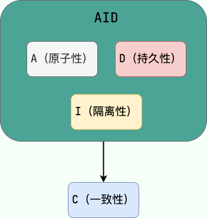
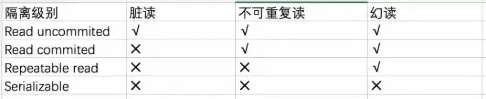
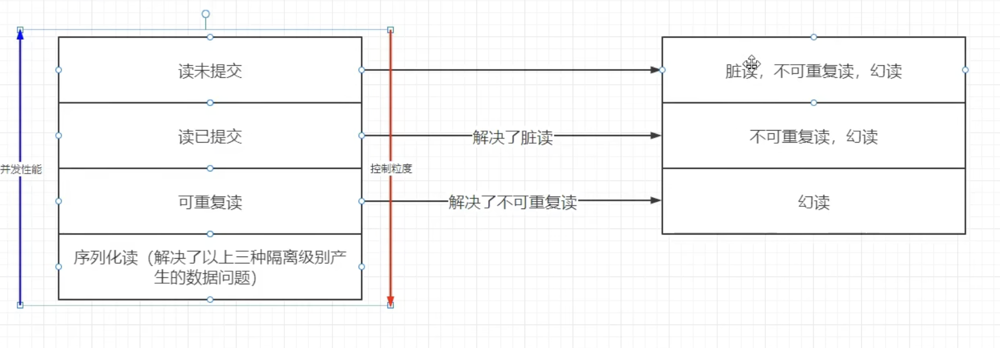

# 事务

## 1.什么是事务

​	事务是应用程序中一系列严密的操作，所有操作必须成功完成，否则在每个操作中所作的所有更改都会被撤消。也就是事务具有原子性，一个事务中的一系列的操作要么全部成功，要么一个都不做。事务的结束有两种，当事务中的所以步骤全部成功执行时，事务提交。如果其中一个步骤失败，将发生回滚操作，撤消撤消之前到事务开始时的所以操作。

### 1.1 事务的ACID

事务具有四个特征：原子性（ Atomicity ）、一致性（ Consistency ）、隔离性（ Isolation ）和持续性（ Durability ）。这四个特性简称为 ACID 特性。

- 原子性。事务是数据库的逻辑工作单位，事务中包含的各操作要么都做，要么都不做
- 一致性。事 务执行的结果必须是使数据库从一个一致性状态变到另一个一致性状态。因此当数据库只包含成功事务提交的结果时，就说数据库处于一致性状态。如果数据库系统 运行中发生故障，有些事务尚未完成就被迫中断，这些未完成事务对数据库所做的修改有一部分已写入物理数据库，这时数据库就处于一种不正确的状态，或者说是 不一致的状态。
- 隔离性。一个事务的执行不能其它事务干扰。即一个事务内部的操作及使用的数据对其它并发事务是隔离的，并发执行的各个事务之间不能互相干扰。
- 持续性。也称永久性，指一个事务一旦提交，它对数据库中的数据的改变就应该是永久性的。接下来的其它操作或故障不应该对其执行结果有任何影响。

**只有保证了事务的持久性、原子性、隔离性之后，一致性才能得到保障。也就是说 A、I、D 是手段，C 是目的！**

### 1.2 MYSQL四种隔离级别

SQL标准定义了4类 隔离级别，包括了一些具体规则，用来限定事务内外的哪些改变是可见的，哪些是不可见的。低级别的隔离级一般支持更高的并发处理，并拥有更低的系统开销。

#### Read Uncommitted（读取未提交内容）

在该隔离级别，所有事务都可以看到其他未提交事务的执行结果。本隔离级别很少用于实际应用，因为它的性能也不比其他级别好多少。读取未提交的数据，也被称之为脏读（Dirty Read）。

#### Read Committed（读取提交内容）

这是大多数数据库系统的默认隔离级别（但不是MySQL默认的）。它满足了隔离的简单定义：一个事务只能看见已经提交事务所做的改变。这种隔离级别 也支持所谓的不可重复读（Nonrepeatable Read），因为同一事务的其他实例在该实例处理其间可能会有新的commit，所以同一select可能返回不同结果。

#### Repeatable Read（可重读）

这是MySQL的默认事务隔离级别，它确保同一事务的多个实例在并发读取数据时，会看到同样的数据行。不过理论上，这会导致另一个棘手的问题：幻读 （Phantom Read）。简单的说，幻读指当用户读取某一范围的数据行时，另一个事务又在该范围内插入了新行，当用户再读取该范围的数据行时，会发现有新的“幻影” 行。InnoDB和Falcon存储引擎通过多版本并发控制（MVCC，Multiversion Concurrency Control）机制解决了该问题。

#### Serializable（可串行化）

这是最高的隔离级别，它通过强制事务排序，使之不可能相互冲突，从而解决幻读问题。简言之，它是在每个读的数据行上加上共享锁。在这个级别，可能导致大量的超时现象和锁竞争。

这四种隔离级别采取不同的锁类型来实现，若读取的是同一个数据的话，就容易发生问题。例如：

> - 脏读(Drity Read)：某个事务已更新一份数据，另一个事务在此时读取了同一份数据，由于某些原因，前一个RollBack了操作，则后一个事务所读取的数据就会是不正确的。
> - 不可重复读(Non-repeatable read):在一个事务的两次查询之中数据不一致，这可能是两次查询过程中间插入了一个事务更新的原有的数据。
> - 幻读(Phantom Read):在一个事务的两次查询中数据笔数不一致，例如有一个事务查询了几列(Row)数据，而另一个事务却在此时插入了新的几列数据，先前的事务在接下来的查询中，就有几列数据是未查询出来的，如果此时插入和另外一个事务插入的数据，就会报错。

在MySQL中，实现了这四种隔离级别，分别有可能产生问题如下所示：

不同隔离级别，解决了不同的问题。

1、读未提交：这一状态是四种隔离中执行最快的，但同样也是问题最多的。读未提交的意思是“当前事务可以读到同时期其它事务还没有提交的数据”，在该隔离级别下，如果事务A对blance表执行了sql`update user set blance = 1000 where id = 1;`（update前该记录blance = 0）此时事务还未提交，同时事务B执行了SQL `select blance from user where id = 1;`，此时事务B会查到id＝1的用户余额是1000，然后事务A因为一些原因执行失败，触发了undo log的rollback发生回滚，然后事务B又来查id为1用户的blance，发现余额变成了0，也就发生了脏读的情况。此外，不可重复读、幻读等这些问题也会在该隔离级别下发生。 

2、读已提交：这一状态下事务只能读到其它事务已经提交的数据，改隔离级别下效率不如读未提交，但可解决脏读的问题。还是刚才的例子事务A尝试修改余额为1000，然后事务B来读余额，但由于事务A未提交，所以事务B读到的blance还是事务A提交前的0，如果后面事务A失败触发回滚，事务B再来读的时候也是0，因此没有脏读的问题。读已提交是通过mvcc机制实现的，事务B在读的时候会生成一个read view，这个read view会去要读的这条记录的undo log版本链上找满足条件的第一个版本的数据返回（同一个事务的多个读操作会生成多个read view）。但无法解决不可重复读和幻读的问题。

3、可重复读：该隔离级别下，事务的多个读操作会共用一个read view，从而解决不可重复读的问题。不可重复读的意思是，一个事务在不同的时间进行多次读取（中途有事务提交），读取到的数据值不一样。通过共用一个read view，使得读时访问到的都是同一undolog版本链，从而保证了数据的一致性。SQL标准下说该隔离级别下无法解决幻读，但实际在MySQL中通过配合锁机制可以消除幻读：比如使用间隙锁锁定一定范围内的数据（间隙锁不锁定当前数据行），让这个范围内的数据无法在该事务结束前发生变更；或者使用行级锁➕间隙锁的组合（next-key-locks）锁定数据行和其相邻的间隙，保证该范围内在该事务未提交前不会发生变更。 

4、串行读：四种隔离级别中隔离度最好的，也是效率最低的（低的还不少）。它的做法是通过innodb中的锁机制，让事务A在操作记录时将记录或表锁定，其它事务既无法读取也无法修改，只能等A事务释放锁后才能进行后续操作，也是这个原因，串行读彻底解决了上述所有问题（除了效率）。幻读的意思是当事务A读取表中的数据后（比如用了count(1)统计满足条件的记录），事务B在事务A还没结束的时候像表中插入了一条记录并提交（也可以是修改某条记录使其满足或不满足条件），然后事务A因为业务需要又执行了一次count(1)，此时发现两次count(1)结果并不一致，就出现了幻读问题（这里的count函数只是举个例子，指的是两次统计得出的记录数量不一致)。