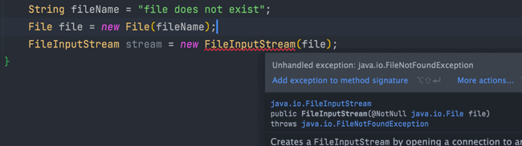
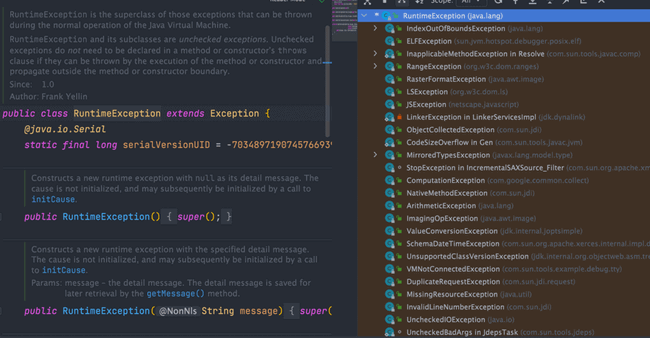

# 异常处理

## 1.Java异常类


### 1.1 Exception和Error的区别

- **`Exception`** :程序本身可以处理的异常，可以通过 `catch` 来进行捕获。`Exception` 又可以分为 Checked Exception（受检查异常，必须处理） 和 Unchecked Exception（不受检查异常，可以不处理）。
- **`Error`**：`Error` 属于程序无法处理的错误，我们没办法通过 `catch` 来进行捕获不建议通过 `catch` 捕获。例如 Java 虚拟机运行错误（`Virtual MachineError`）、虚拟机内存不够错误(`OutOfMemoryError`)、类定义错误（`NoClassDefFoundError`）等。这些异常发生时，Java 虚拟机（JVM）一般会选择线程终止。

### 1.2 Checked Exception 和 UnChecked Exception区别

**Checked Exception** 即 受检查异常，Java 代码在编译过程中，如果受检查异常没有被 `catch` 或者 `throws` 关键字处理的话，就没办法通过编译。

比如下面这段 IO 操作的代码：



除了 `RuntimeException` 及其子类以外，其他的 `Exception` 类及其子类都属于受检查异常。常见的受检查异常有：IO 相关的异常、`ClassNotFoundException`、`SQLException`...。


**Unchecked Exception** 即 **不受检查异常**，Java 代码在编译过程中，我们即使不处理不受检查异常也可以正常通过编译。

`RuntimeException` 及其子类都统称为非受检查异常，常见的有（建议记下来，日常开发中会经常用到）：

- `NullPointerException`（空指针错误）
- `IllegalArgumentException`（参数错误比如方法入参类型错误）
- `NumberFormatException`（字符串转换为数字格式错误，`IllegalArgumentException` 的子类）
- `ArrayIndexOutOfBoundsException`（数组越界错误）
- `ClassCastException`（类型转换错误）
- `ArithmeticException`（算术错误）
- `SecurityException`（安全错误比如权限不够）
- `UnsupportedOperationException`（不支持的操作错误比如重复创建同一用户）



默认使用 Unchecked Exception，只在必要时才用 Checked Exception。

我们可以把 Unchecked Exception（比如 `NullPointerException`）看作是代码 Bug。对待 Bug，最好的方式是让它暴露出来然后去修复代码，而不是用 `try-catch` 去掩盖它。

一般来说，只在一种情况下使用 Checked Exception：当这个异常是业务逻辑的一部分，并且调用方必须处理它时。比如说，一个余额不足异常。这不是 bug，而是一个正常的业务分支，我需要用 Checked Exception 来强制调用者去处理这种情况，比如提示用户去充值。这样就能在保证关键业务逻辑完整性的同时，让代码尽可能保持简洁。

### 1.3 throwable类常用方法

- `String getMessage()`: 返回异常发生时的详细信息
- `String toString()`: 返回异常发生时的简要描述
- `String getLocalizedMessage()`: 返回异常对象的本地化信息。使用 `Throwable` 的子类覆盖这个方法，可以生成本地化信息。如果子类没有覆盖该方法，则该方法返回的信息与 `getMessage()` 返回的结果相同
- `void printStackTrace()`: 在控制台上打印 `Throwable` 对象封装的异常信息

### 1.4 try-catch-finally

- `try` 块：用于捕获异常。其后可接零个或多个 `catch` 块，如果没有 `catch` 块，则必须跟一个 `finally` 块。
- `catch` 块：用于处理 try 捕获到的异常。
- `finally` 块：无论是否捕获或处理异常，`finally` 块里的语句都会被执行。当在 `try` 块或 `catch` 块中遇到 `return` 语句时，`finally` 语句块将在方法返回之前被执行。

```java
try {
    System.out.println("Try to do something");
    throw new RuntimeException("RuntimeException");
} catch (Exception e) {
    System.out.println("Catch Exception -> " + e.getMessage());
} finally {
    System.out.println("Finally");
}
```

**注意：不要在 finally 语句块中使用 return!** 当 try 语句和 finally 语句中都有 return 语句时，try 语句块中的 return 语句会被忽略。这是因为 try 语句中的 return 返回值会先被暂存在一个本地变量中，当执行到 finally 语句中的 return 之后，这个本地变量的值就变为了 finally 语句中的 return 返回值。

```java
public static void main(String[] args) {
    System.out.println(f(2));
}

public static int f(int value) {
    try {
        return value * value;
    } finally {
        if (value == 2) {
            return 0;
        }
    }
}
//输出为0
```

finally中的代码不一定一定运行 ，finally 之前虚拟机被终止运行的话，finally 中的代码就不会被执行。

```java
try {
    System.out.println("Try to do something");
    throw new RuntimeException("RuntimeException");
} catch (Exception e) {
    System.out.println("Catch Exception -> " + e.getMessage());
    // 终止当前正在运行的Java虚拟机
    System.exit(1);
} finally {
    System.out.println("Finally");
}
```

另外，在以下 2 种特殊情况下，`finally` 块的代码也不会被执行：

1. 程序所在的线程死亡。
2. 关闭 CPU。

### 1.5 异常注意点

- 不要把异常定义为静态变量，因为这样会导致异常栈信息错乱。每次手动抛出异常，我们都需要手动 new 一个异常对象抛出。
- 抛出的异常信息一定要有意义。
- 建议抛出更加具体的异常，比如字符串转换为数字格式错误的时候应该抛出 `NumberFormatException` 而不是其父类 `IllegalArgumentException`。
- 避免重复记录日志：如果在捕获异常的地方已经记录了足够的信息（包括异常类型、错误信息和堆栈跟踪等），那么在业务代码中再次抛出这个异常时，就不应该再次记录相同的错误信息。重复记录日志会使得日志文件膨胀，并且可能会掩盖问题的实际原因，使得问题更难以追踪和解决。

## 2.数据校验

### 2.1 前端校验

Element-ui 的 form组件rule双向绑定dataRule

```vue
<el-form
      :model="dataForm"
      :rules="dataRule"
      ref="dataForm"
      @keyup.enter.native="dataFormSubmit()"
      label-width="140px"
    >
      <el-form-item label="品牌名" prop="name">
        <el-input v-model="dataForm.name" placeholder="品牌名"></el-input>
      </el-form-item>
      <el-form-item label="品牌logo地址" prop="logo">
        <!-- <el-input v-model="dataForm.logo" placeholder="品牌logo地址"></el-input> -->
        <single-upload v-model="dataForm.logo"></single-upload>
      </el-form-item>
      <el-form-item label="介绍" prop="descript">
        <el-input v-model="dataForm.descript" placeholder="介绍"></el-input>
      </el-form-item>
      <el-form-item label="显示状态" prop="showStatus">
        <el-switch
          v-model="dataForm.showStatus"
          active-color="#13ce66"
          inactive-color="#ff4949"
          :active-value="1"
          :inactive-value="0"
        ></el-switch>
      </el-form-item>
      <el-form-item label="检索首字母" prop="firstLetter">
        <el-input v-model="dataForm.firstLetter" placeholder="检索首字母"></el-input>
      </el-form-item>
      <el-form-item label="排序" prop="sort">
        <el-input v-model.number="dataForm.sort" placeholder="排序"></el-input>
      </el-form-item>
    </el-form>
```

```javascript
dataRule: {
        name: [{ required: true, message: "品牌名不能为空", trigger: "blur" }],
        logo: [
          { required: true, message: "品牌logo地址不能为空", trigger: "blur" }
        ],
        descript: [
          { required: true, message: "介绍不能为空", trigger: "blur" }
        ],
        showStatus: [
          {
            required: true,
            message: "显示状态[0-不显示；1-显示]不能为空",
            trigger: "blur"
          }
        ],
          //自定义校验器
        firstLetter: [
          {
            validator: (rule, value, callback) => {
              if (value == "") {
                callback(new Error("首字母必须填写"));
              } else if (!/^[a-zA-Z]$/.test(value)) {
                callback(new Error("首字母必须a-z或者A-Z之间"));
              } else {
                callback();
              }
            },
            trigger: "blur"
          }
        ],
        sort: [
          {
            validator: (rule, value, callback) => {
              if (value === "") {
                callback(new Error("排序字段必须填写"));
              } else if (!Number.isInteger(value) || value<0) {
                callback(new Error("排序必须是一个大于等于0的整数"));
              } else {
                callback();
              }
            },
            trigger: "blur"
          }
        ]
      }
```


### 2.2 后端校验(JSR303数据校验)

给Bean添加校验注解:javax.validation.constraints，并定义自己的message提示
开启校验功能@Valid
效果：校验错误以后会有默认的响应；
给校验的bean后紧跟一个BindingResult，就可以获取到校验的结果
分组校验（多场景的复杂校验）
@NotBlank(message = "品牌名必须提交",groups = {AddGroup.class,UpdateGroup.class})
给校验注解标注什么情况需要进行校验
@Validated({AddGroup.class})
默认没有指定分组的校验注解@NotBlank，在分组校验情况@Validated({AddGroup.class})下不生效，只会在@Validated生效；

```
import javax.validation.constraints //继承的包
```

#### 2.2.1 JSR303简介

1. JSR-303 是 JAVA EE 6 中的一项子规范，叫做 Bean Validation。

2. 在任何时候，当你要处理一个应用程序的业务逻辑，数据校验是你必须要考虑和面对的事情。

3. Bean Validation 为 JavaBean 验证定义了相应的元数据模型和 API。

4. constraint 可以附加到字段，getter 方法，类或者接口上面。

5. 对于一些特定的需求，用户可以很容易的开发定制化的 constraint。

6. Bean Validation 是一个运行时的数据验证框架，在验证之后验证的错误信息会被马上返回。

#### 2.2.2 Bean Validation 规范内嵌的约束注解

限制	说明
@Null	限制只能为null
@NotNull	限制必须不为null
@AssertFalse	限制必须为false
@AssertTrue	限制必须为true
@DecimalMax(value)	限制必须为一个不大于指定值的数字
@DecimalMin(value)	限制必须为一个不小于指定值的数字
@Digits(integer,fraction)	限制必须为一个小数，且整数部分的位数不能超过integer，小数部分的位数不能超过fraction
@Future	限制必须是一个将来的日期
@Max(value)	限制必须为一个不大于指定值的数字
@Min(value)	限制必须为一个不小于指定值的数字
@Past	限制必须是一个过去的日期
@Pattern(value)	限制必须符合指定的正则表达式
@Size(max,min)	限制字符长度必须在min到max之间
@Past	验证注解的元素值（日期类型）比当前时间早
@NotEmpty	验证注解的元素值不为null且不为空（字符串长度不为0、集合大小不为0）
@NotBlank	验证注解的元素值不为空（不为null、去除首位空格后长度为0），不同于@NotEmpty，@NotBlank只应用于字符串且在比较时会去除字符串的空格
@Email	验证注解的元素值是Email，也可以通过正则表达式和flag指定自定义的email格式

#### 2.2.3 给参数对象中的成员变量增加注解

```java
public class BrandEntity implements Serializable {
	private static final long serialVersionUID = 1L;

	/**
	 * 品牌id
	 */
	@NotNull(message = "修改必须指定品牌id",groups = {UpdateGroup.class})
	@Null(message = "新增不能指定id",groups = {AddGroup.class})
	@TableId
	private Long brandId;
	/**
	 * 品牌名
	 */
	@NotBlank(message = "品牌名必须提交",groups = {AddGroup.class,UpdateGroup.class})
	private String name;
	/**
	 * 品牌logo地址
	 */
	@NotBlank(groups = {AddGroup.class})
	@URL(message = "logo必须是一个合法的url地址",groups={AddGroup.class,UpdateGroup.class})
	private String logo;
	/**
	 * 介绍
	 */
	private String descript;
	/**
	 * 显示状态[0-不显示；1-显示]
	 */
//	@Pattern()
	@NotNull(groups = {AddGroup.class, UpdateStatusGroup.class})
	@ListValue(vals={0,1},groups = {AddGroup.class, UpdateStatusGroup.class})
	private Integer showStatus;
	/**
	 * 检索首字母
	 */
	@NotEmpty(groups={AddGroup.class})
	@Pattern(regexp="^[a-zA-Z]$",message = "检索首字母必须是一个字母",groups={AddGroup.class,UpdateGroup.class})
	private String firstLetter;
	/**
	 * 排序
	 */
	@NotNull(groups={AddGroup.class})
	@Min(value = 0,message = "排序必须大于等于0",groups={AddGroup.class,UpdateGroup.class})
	private Integer sort;
}
```

#### 2.2.4 Controller @Valid 开启校验

Controller 中需要校验的参数Bean前添加 @Valid开启校验功能，紧跟在校验的Bean后添加一个BindingResult，BindingResult封装了前面Bean的校验结果。

```java
/**
     * 保存
     */
    @RequestMapping("/save")
    public R save(/*@Valid*/ @Validated(AddGroup.class) @RequestBody BrandEntity brand/*, BindingResult result*/){
//        if (result.hasErrors()) {
//            Map<String, String> map = new HashMap<>();
//            // 获取校验的错误结果
//            result.getFieldErrors().forEach((item) -> {
//                // 获取到错误提示FieldError
//                String message = item.getDefaultMessage();
//                // 获取错误的属性名字
//                String field = item.getField();
//                map.put(field, message);
//            });
//            return R.ok().error(400, "提交的数据不合法").put("data", map);
//        }else {
//            brandService.save(brand);
//            return R.ok();
//        }
        brandService.save(brand);
        return R.ok();
    }

```

#### 2.2.5 分组校验

@Validated(AddGroup.class)

```java
import javax.validation.groups.Default;

/**
 * 新增数据 Group
 */
public interface AddGroup extends Default {
}

/**
 * 更新数据 Group
 */
public interface UpdateGroup {
}
```

javax.validation默认是Default默认分组。接口继承Default可以校验没有标注分组的字段

## 3.统一异常处理

@ControllerAdvice
编写异常处理类，使用@ControllerAdvice。
使用@ExceptionHandler标注方法可以处理的异常。

@RestControllerAdvice =@Restbody + @ControllerAdvice basePackages指定需要集中处理的controller

```java
/**
 * 集中处理所有异常
 */
@Slf4j
@RestControllerAdvice(basePackages = "com.yizhan.gulimail.product.controller")
public class GulimallExceptionControllerAdvice {
    /**
     * 统一处理异常，可以使用Exception.class先打印一下异常类型来确定具体异常
     */
    @ExceptionHandler(value = MethodArgumentNotValidException.class)
    public R handleValidException(MethodArgumentNotValidException e) {
        log.error("数据校验出现问题{}, 异常类型:{}", e.getMessage(), e.getClass());
        BindingResult result = e.getBindingResult();
        Map<String, String> errorMap = new HashMap<>(16);
        // 获取校验的错误结果
        result.getFieldErrors().forEach((item) -> {
            // 获取错误的属性名字 + 获取到错误提示FieldError
            errorMap.put(item.getField(), item.getDefaultMessage());
        });
        return R.error(BizCodeEnume.VALID_EXCEPTION.getCode(), BizCodeEnume.VALID_EXCEPTION.getMsg()).put("data", errorMap);
    }

    @ExceptionHandler(value = Throwable.class)
    public R handleValidException(Throwable throwable) {
        log.error("Throwable错误，未处理：" + throwable);
        return R.error(BizCodeEnume.UNKNOW_EXCEPTION.getCode(), BizCodeEnume.UNKNOW_EXCEPTION.getMsg());
    }
}
```

#### 3.1 自定义异常类型

一般处理的都是 `RuntimeException` ，所以如果需要自定义异常类型的话

```java
**
 * 自定义异常
 *
 * @author Mark sunlightcs@gmail.com
 */
public class RRException extends RuntimeException {
	private static final long serialVersionUID = 1L;
	
    private String msg;
    private int code = 500;
    
    public RRException(String msg) {
		super(msg);
		this.msg = msg;
	}
	
	public RRException(String msg, Throwable e) {
		super(msg, e);
		this.msg = msg;
	}
	
	public RRException(String msg, int code) {
		super(msg);
		this.msg = msg;
		this.code = code;
	}
	
	public RRException(String msg, int code, Throwable e) {
		super(msg, e);
		this.msg = msg;
		this.code = code;
	}

	public String getMsg() {
		return msg;
	}

	public void setMsg(String msg) {
		this.msg = msg;
	}

	public int getCode() {
		return code;
	}

	public void setCode(int code) {
		this.code = code;
	}
}
```

### 3.2 错误码和错误信息定义类

这个枚举的主要作用就是统一管理系统中可能出现的异常，比较清晰明了。但是，可能出现的问题是当系统过于复杂，出现的异常过多之后，这个枚举会比较庞大。有一种解决办法：将多种相似的异常统一为一个，比如将用户找不到异常和订单信息未找到的异常都统一为“未找到该资源”这一种异常，然后前端再对相应的情况做详细处理

```java
/**
 * 错误码和错误信息定义类
 * 1.错误码定义规则为5为数字
 * 2.前两位表示业务场景，最后三位表示错误码。例如:100001。10:通用001:系统未知
 * 异常
 * 3.维护错误码后需要维护错误描述，将他们定义为枚举形式
 * 错误码列表:
 * 10:通用
 *      001:参数格式校验
 *      002:短信验证频率太高
 * 11:商品
 * 12:订单
 * 13:购物车
 * 14:物流
 * 21:库存
 */
public enum BizCodeEnume {

    UNKNOW_EXCEPTION(10000, "系统未知异常"),
    VALID_EXCEPTION(10001, "参数格式验证失败"),
    SMS_CODE_EXCEPTION(10002, "验证码获取频率太高，请稍后再试"),
    TO_MANY_REQUEST(10002, "请求流量过大，请稍后再试"),

    IDEMPOTENT_TOKEN_CREATE_EXCEPTION(10003, "令牌创建失败"),
    IDEMPOTENT_TOKEN_VERIFY_EXCEPTION(10003, "令牌校验失败"),

    PRODUCT_UP_EXCEPTION(11000, "商品上架异常"),
    USER_EXIST_EXCEPTION(15001, "存在相同的用户"),
    PHONE_EXIST_EXCEPTION(15002, "存在相同的手机号"),
    LOGINACCT_PASSWORD_EXCEPTION(15003, "账号或密码错误"),
    NO_STOCK_EXCEPTION(21000, "商品库存不足");

    private int code;
    private String msg;

    BizCodeEnume(int code, String msg) {
        this.code = code;
        this.msg = msg;
    }

    public int getCode() {
        return code;
    }

    public String getMsg() {
        return msg;
    }
}
```


## 4.自定义校验注解

### 4.1 自定义注解

@Constraint 指定校验器

```java
@Target({METHOD, FIELD, ANNOTATION_TYPE, CONSTRUCTOR, PARAMETER, TYPE_USE})// 可以标注在哪些位置 方法、参数、构造器
@Retention(RUNTIME)// 可以在什么时候获取到
@Documented//
@Constraint(validatedBy = {ListValueConstraintValidator.class})// 使用哪个校验器进行校验的（这里不指定，在初始化的时候指定）
public @interface ListValue {
    // 默认会找ValidationMessages.properties
    String message() default "{com.yizhan.common.groupListValue.message}";

    Class<?>[] groups() default {};

    Class<? extends Payload>[] payload() default {};

    // 可以指定数据只能是vals数组指定的值
    int[] vals() default {};
}
```

### 4.2 ValidationMessages.properties

```properties
com.yizhan.common.groupListValue.message=必须添加指定的值
```

### 4.3 校验器

```java
import javax.validation.ConstraintValidator;
import javax.validation.ConstraintValidatorContext;
import java.util.HashSet;
import java.util.Set;

public class ListValueConstraintValidator implements ConstraintValidator<ListValue, Integer> {

    private Set<Integer> set = new HashSet<>();

    /**
     * 初始化方法
     * @param constraintAnnotation
     */
    @Override
    public void initialize(ListValue constraintAnnotation) {
        int[] vals = constraintAnnotation.vals();
        if (vals != null && vals.length != 0) {
            for (int val : vals) {
                set.add(val);
            }
        }
    }

    /**
     * 校验逻辑
     * @param value   需要校验的值
     * @param context 上下文
     * @return
     */
    @Override
    public boolean isValid(Integer value, ConstraintValidatorContext context) {
        return set.contains(value);// 如果set length==0，会返回false
    }
}
```

