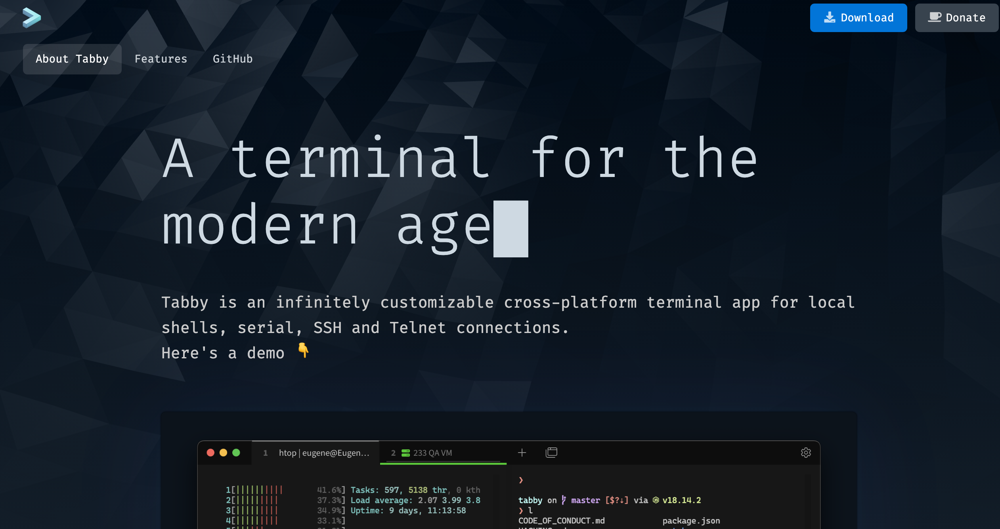
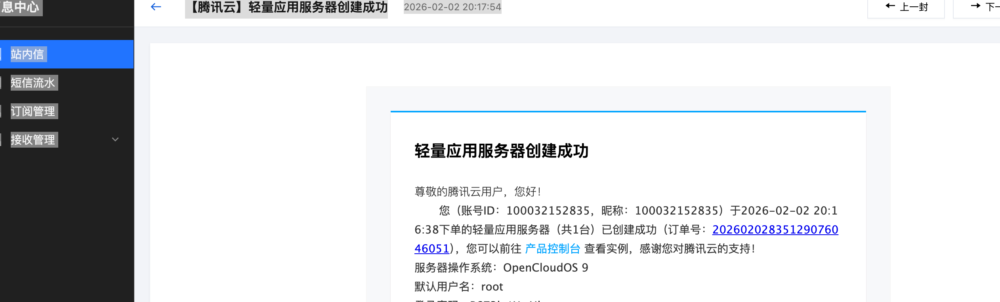
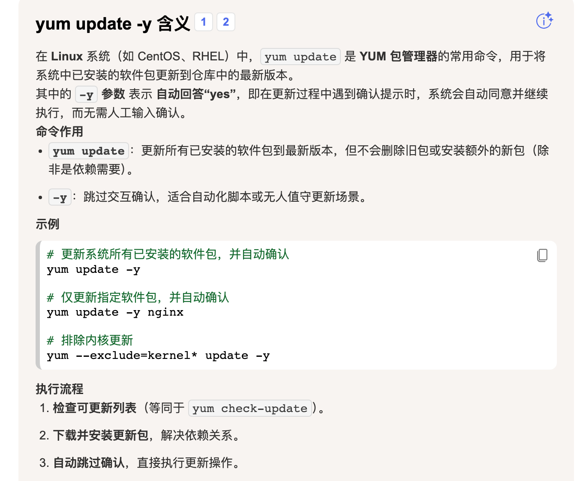

<!-- ---
title: 腾讯云服务器安装 MySQL Redis
date: 2026-07-16
category: 运维
tags:
  - 服务器
  - MySQL
  - Redis
  - 腾讯云
  - 部署
--- -->

# 腾讯云服务器安装mysql redis

windows转到Mac后，本地虚拟机一直创建不起来，于是决定买一台最低配置的服务器用来当作开发环境，后续也可以用来搭建小型项目

## ssh工具 tabby



第一感觉挺好看的 it has bretty UI


## 腾讯云服务器




```
yum update -y
```



```
yum install -y mysql-server
```

```
Error:                                                                                         
 Problem: package mysql-server-8.0.44-1.oc9.x86_64 from AppStream requires mysql, but none of t
he providers can be installed                                                                  
  - cannot install the best candidate for the job                                              
  - package mysql-8.0.41-2.oc9.x86_64 from AppStream is filtered out by exclude filtering      
  - package mysql-8.0.43-1.oc9.x86_64 from AppStream is filtered out by exclude filtering      
  - package mysql-8.0.43-2.oc9.x86_64 from AppStream is filtered out by exclude filtering      
  - package mysql-8.0.44-1.oc9.x86_64 from AppStream is filtered out by exclude filtering      
(try to add '--skip-broken' to skip uninstallable packages or '--nobest' to use not only best c
andidate packages)         
```

报错换命令行


```
sudo yum localinstall https://dev.mysql.com/get/mysql80-community
-release-el7-3.noarch.rpm 
```


```
sudo yum install mysql-server -y
```

换指令

```
yum install -y iSulad --nogpgcheck
```


```
sudo mysql_secure_installation
```

mysql安全检查

需要输入默认密码

```
grep "password" /var/log/mysqld.log 
```

查询日志文件

```
sudo mysql_secure_installation
```

进行mysql安全检查并且更换password

```
mysql -u root -p 
```

登录mysql数据库


```
ALTER USER 'root'@'localhost' PASSWORD EXPIRE NEVER;
```

设置密码永不过期


```
flush privileges;
```

刷新权限表

```
mysql -u root -p  
```

登录mysql

```
update user set host = '%' where user = 'root'
```

```
flush privileges
```

更新权限后刷新权限


## 腾讯云如何安装REDIS

1、连接腾讯云服务器创建相关目录
通过XShell或者其他工具连接云服务器，在/usr/local目录下创建redis文件夹；

移动到目标路径： cd /usr/local/
创建redis文件夹：mkdir redis

2、下载Redis压缩包
Redis 历史版本下载URL：http://download.redis.io/releases/

下载方式一：选择需要的版本，下载到本地然后通过Xftp上传到创建好的/usr/local/redis目录下，这里不演示；

下载方式二：选择需要下载的版本(这里以3.2.10为例)，右键复制链接地址，然后进行如下操作：

进入刚创建好的redis目录：cd ./redis （或cd /usr/local/redis）
下载redis压缩包命令：wget http://download.redis.io/releases/redis-3.2.10.tar.gz

**报错选择redis版本为6**

通过以上两步等待上传或下载完成后，redis目录下存在如下压缩包

3、解压
解压命令：tar -xzvf redis-3.2.10.tar.gz

4、安装和相关配置
等待解压完成后，进入解压目录进行安装

进入解压目录：cd ./redis-3.2.10
进行安装(在解压解压好的redis文件夹下及redis-3.2.10下)命令：make

等待安装完成后，先进行相关配置，然后再启动服务；

确保安装完成，进行配置步骤如下：

①打开配置文件命令：vim ./redis.conf

可以打开如下配置文件：redis.conf配置文件

②、在配置文件61行左右(行数在右下角)，注释掉172.0.0.1（默认redis是只能内网127.0.0.1访问，如果想外网访问需要修改绑定的地址）

③、设置redis可以一直在后台运行，以守护进程方式运行，即关闭SSH工具程序也在运行。
将 daemonize no 改成 daemonize yes（在128行左右）

④、密码设置，将”#requirepass foobared“ 取掉注释改成 requirepass 123456(或者其它你需要的密码)（在480行左右）

注意：去掉注释时将前面的空格一并去掉；

⑤保存退出：在Insert模式下按Esc进入命令模式，然后输入:wq保存退出

5、服务启动
进入redis的src目录：cd ./src(在redis解压目录下) cd /usr/local/redis/redis-3.2.10/src（绝对路径）

启动服务：./redis-server ../redis.conf

6、查看是否启动成功
ps aux | grep redis

**记住远程链接用户名为default**