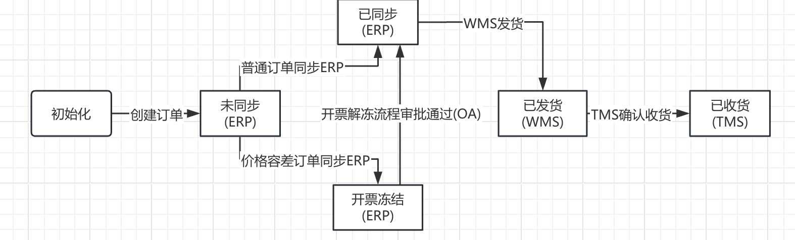

---
title: Cola-StateMachine 状态机的实战使用
date: 2025-03-10
category: 架构
tags:
  - 状态机
  - Cola
  - 设计模式
---

# Cola-StateMachine状态机的实战使用

## 1:问题背景

在做公司自研CRM系统时候，需要独立模块为一家联营控股的公司提供销售服务，要求是与公司原本业务相似，因此在查看公司原本代码时候，我被系统的耦合程度和if-else地狱深深的震惊了。因此为了解耦合我在前期做了状态机的调研，本来初步是直接用Spring自带的状态机但是因为项目过老，依赖冲突无法解决。最后选择了cola状态机。

## 2:基本介绍

COLA 框架的状态机组件是一种小巧、无状态、简单、轻量、性能极高的状态机 DSL 实现，解决业务中的状态流转问题。

Cola-StateMachine 中的核心概念：

1. State : 状态
2. Event：事件，状态由事件触发，引起变化
3. Transtition：流转，表示从一个状态到另一个状态
4. External Transititon：外部流转，两个不同状态之间的流转
5. Interal Transtition：内部流转，同一个状态之间的流转
6. Condition：条件，标识是否允许到达某个状态
7. Action：动作，到达某个状态以后，可以做什么
8. StateMachine：状态

## 3:流程图例子



该图以作者本人工作经历生成的部分订单状态流转流程图，方便起见该图无冲销。

## 4:Cola-StateMachine工作状态


## 5:引入依赖

``` xml
  <dependency>
    <groupId>com.alibaba.cola</groupId>
    <artifactId>cola-component-statemachine</artifactId>
    <version>4.2.1</version>
  </dependency>
```

## 6:定义订单基本配置

```java
//订单类
public class Order {
    //主键
    Integer key;
    //订单类型
    String type;
    //其他内容
    String content;

    public Order(Integer key, String content, String type) {
        this.key = key;
        this.content = content;
        this.type = type;
    }

    public Integer getKey() {
        return key;
    }

    public void setKey(Integer key) {
        this.key = key;
    }

    public String getType() {
        return type;
    }

    public void setType(String type) {
        this.type = type;
    }

    public String getContent() {
        return content;
    }

    public void setContent(String content) {
        this.content = content;
    }

    @Override
    public String toString() {
        return "Order{" +
                "key=" + key +
                ", type='" + type + '\'' +
                ", content='" + content + '\'' +
                '}';
    }
}
```

```java
/**
 * 订单状态枚举
 */
public enum OrderStatusEnum {
    INIT("0","初始化"),
    NOTSYNCED("1", "未同步"),
    SYNCED("2", "已同步"),
    INVOICEFREEZE("3", "开票冻结"),
    SHIPPED("4", "已发货"),
    RECEIVED("5", "已收货");

    private final String code;
    private final String desc;

    OrderStatusEnum(String code, String desc)
    {
        this.code = code;
        this.desc = desc;
    }

    public String getCode()
    {
        return code;
    }

    public String getDesc()
    {
        return desc;
    }

    public static OrderStatusEnum fromCode(String code)
    {
        for (OrderStatusEnum s : values())
        {
            if (s.code.equals(code))
            {
                return s;
            }
        }
        throw new IllegalArgumentException("未知订单状态: " + code);
    }
}
```


```java
/**
 * 订单事件枚举
 */
public enum OrderEventEnum
{
    /** 订单创建 */
    ORDER_CREATE,
    /** 普通订单同步 */
    ORDER_SYNC,
    /** 价格容差订单同步 */
    TOLERANCE_SYNC,
    /** 流程审批 */
    PROCESS_APPROVAL,
    /** 发货 */
    GOOD_SHIPPED,
    /** 收货 */
    GOOD_RECEIVED,
}
```

如果项目中有多个状态机，可以增加状态机枚举，进一步解耦。

```java
//状态机ID 枚举
  public enum StateMachineIdEnum {
    ORDER_OF_SALE("ORDER_OF_SALE",
    OrderBizEnum.SALE_ORDER, "订单状态机");
  }
```

## 7:订单状态机配置

```java
/**
 * 订单状态机配置
 *
 */
public class OrderStateMachineConfig
{
    public StateMachine<OrderStatusEnum, OrderEventEnum, OrderStateMachineContext> orderStateMachine()
    {
        StateMachineBuilder<OrderStatusEnum, OrderEventEnum, OrderStateMachineContext> builder =
                StateMachineBuilderFactory.create();

        // 初始化 -> 未同步（订单创建，仅订单内容为初始化）
        builder.externalTransition()
                .from(OrderStatusEnum.INIT)
                .to(OrderStatusEnum.NOTSYNCED)
                .on(OrderEventEnum.ORDER_CREATE)
                .when(checkContent())
                .perform(orderCreate());

        // 初始化 -> 未同步（订单同步，仅订单类型为0）
        builder.internalTransition()
                .within(OrderStatusEnum.SYNCED)
                .on(OrderEventEnum.ORDER_SYNC)
                .when(checkType())
                .perform(orderCreate());

        // 未同步，开票冻结 -> 已同步（订单创建，仅订单类型为0）
        builder.externalTransitions()
                .fromAmong(OrderStatusEnum.NOTSYNCED,OrderStatusEnum.INVOICEFREEZE)
                .to(OrderStatusEnum.SYNCED)
                .on(OrderEventEnum.ORDER_SYNC)
                .when(checkType())
                .perform(orderCreate());

        return builder.build("orderStateMachine");
    }

    /**
     * 条件：仅订单其他内容(content='0')可以确认
     */
    private Condition<OrderStateMachineContext> checkContent()
    {
        return ctx -> "0".equals(ctx.getOrder().getContent());
    }

    /**
     * 条件：仅订单类型(type='0')可以确认
     */
    private Condition<OrderStateMachineContext> checkType()
    {
        return ctx -> "0".equals(ctx.getOrder().getType());
    }

    /**
     * 动作：创建订单 - 创建订单
     */
    private Action<OrderStatusEnum, OrderEventEnum, OrderStateMachineContext> orderCreate()
    {
        return (from, to, event, ctx) -> {
            Order e = ctx.getOrder();
            e.setContent(to.getCode());
            e.setType(ctx.getExtraInformation());
        };
    }

    /**
     * 动作：开票冻结 - 价格容差订单同步SAP，开票冻结
     */
    private Action<OrderStatusEnum, OrderEventEnum, OrderStateMachineContext> invoiceUnFreeze()
    {
        return (from, to, event, ctx) -> {
            Order e = ctx.getOrder();
            e.setContent(to.getCode());
            e.setType(ctx.getExtraInformation());
        };
    }
}
```

```java
/**
 * 订单状态机上下文
 */
public class OrderStateMachineContext
{
    private final Order order;
    private String extraInformation;

    public OrderStateMachineContext(Order order)
    {
        this.order = order;
    }

    public Order getOrder()
    {
        return order;
    }

    public String getExtraInformation()
    {
        return extraInformation;
    }

    public void setExtraInformation(String extraInformation)
    {
        this.extraInformation = extraInformation;
    }
}
```

## 8:详细说明

```java
// 初始化 -> 未同步（订单创建，仅订单内容为初始化）
        builder.externalTransition()
                .from(OrderStatusEnum.INIT)
                .to(OrderStatusEnum.NOTSYNCED)
                .on(OrderEventEnum.ORDER_CREATE)
                .when(checkContent())
                .perform(orderCreate());
```

单个起始状态-外部状态流转。订单从INIT到NOTSYNCED状态，并在满足checkContent时候，执行orderCreate方法。

```java
// 初始化 -> 未同步（订单同步，仅订单类型为0）
        builder.internalTransition()
                .within(OrderStatusEnum.SYNCED)
                .on(OrderEventEnum.ORDER_SYNC)
                .when(checkType())
                .perform(orderCreate());
```

订单起始状态发生在SYNCED状态下，当发生发货时执行状态流转，当满足 checkType时，执行orderCreate，执行成功则返回状态：SYNCED。

```java
// 未同步，开票冻结 -> 已同步（订单创建，仅订单类型为0）
        builder.externalTransitions()
                .fromAmong(OrderStatusEnum.NOTSYNCED,OrderStatusEnum.INVOICEFREEZE)
                .to(OrderStatusEnum.SYNCED)
                .on(OrderEventEnum.ORDER_SYNC)
                .when(checkType())
                .perform(orderCreate());
```

订单起始状态为：NOTSYNCED、INVOICEFREEZE时，当满足 checkType 时，执行 orderCreate，返回状态 SYNCED。

* 上述例子不和状态流程图完全相符。

## 9:测试代码

```java
public class Test {
    public static void main(String[] args) {
        OrderStateMachineConfig orderStateMachineConfig = new OrderStateMachineConfig();
        StateMachine<OrderStatusEnum, OrderEventEnum, OrderStateMachineContext> orderStateMachine = orderStateMachineConfig.orderStateMachine();

        //初始化订单
        Order order = new Order(1,"0","1");
        System.out.println(order.toString());

        OrderStatusEnum currentStatus = OrderStatusEnum.fromCode(order.getContent());
        OrderStateMachineContext ctx = new OrderStateMachineContext(order);
        ctx.setExtraInformation("当日发货");

        OrderStatusEnum orderStatusEnum = orderStateMachine.fireEvent(currentStatus, OrderEventEnum.ORDER_CREATE, ctx);
        System.out.println(order.toString());
    }
}
```

## 10:个人感悟

* 问题1:为什么不在action中直接修改数据库，只修改对应的对象

  1. 关注点分离 — 状态机只负责"状态该怎么变"这一业务规则，不应感知数据库的存在。把 Mapper 调用塞进 Action 里，状态机就绑定了持久层，无法单独测试状态流转逻辑。

  2. 事务边界清晰 — 状态变更往往需要和其他操作在同一事务中。比如 resolveEvent 里状态机算出目标状态后，Service 层在一个方法里原子地执行了"更新状态 + 更新解除时间"（EventServiceImpl.java:98-105）。如果 Action 自己调 DB，就没法和其他写操作事务绑定。

     Action 只改 context 里的内容，service负责持久化。

* 问题2:状态机上下文中添加格外字段有什么用

   如果不放 context 里，Action 就没有途径拿到这个反馈数据。如果将来某个操作也需要附加备注等信息，同样可以在 context 里加对应字段。 